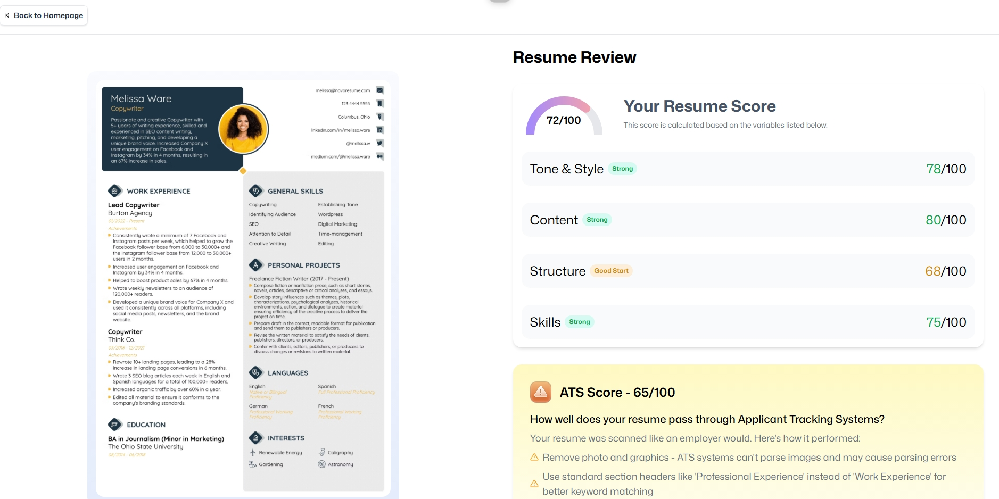

# Resume Buddy: AI-Powered Resume Analyzer

<div align="center">
  
  <br />
  <div>
    
    
    
    
    
  </div>
  <h3 align="center">Resume Buddy: AI-Powered Resume Analyzer</h3>
  <div align="center">
    Build, analyze, and optimize your resume with smart AI feedback and seamless cloud storage.
  </div>
</div>

---

## 📋 Table of Contents

1. ✨ [Introduction](#introduction)
2. ⚙️ [Tech Stack](#tech-stack)
3. 🔋 [Features](#features)
4. 🤸 [Quick Start](#quick-start)
5. 🔗 [Assets](#assets)
6. 👥 [Contributing](#contributing)
7. 💬 [Feedback & Support](#feedback)
8. 📝 [License](#license)

---

## ✨ Introduction

**Resume Buddy** is a modern web app that helps you create, upload, and analyze your resume using AI. Get instant ATS scores, actionable feedback, and store all your resumes securely in the cloud. Built with React, TypeScript, Puter.js, and Tailwind CSS, Resume Buddy offers a clean, responsive UI and a seamless user experience.

---

## ⚙️ Tech Stack

- **React**: Component-based UI library for fast, interactive web apps.
- **React Router v7**: Powerful routing for nested routes, code splitting, and SSR.
- **TypeScript**: Static typing for safer, scalable code.
- **Tailwind CSS**: Utility-first CSS for rapid, custom design.
- **Puter.js**: Serverless auth, storage, and AI features—no backend required.
- **Vite**: Lightning-fast build tool and dev server.
- **Zustand**: Minimal, performant state management for React.

---

## 🔋 Features

- **Easy Authentication**: Secure, in-browser login with Puter.js.
- **Resume Upload & Storage**: Upload and manage multiple resumes in your personal cloud.
- **AI Resume Analysis**: Get ATS scores and personalized feedback for each resume.
- **Reusable UI Components**: Clean, modular design for maintainability.
- **Responsive Design**: Works seamlessly across devices.
- **Modern UI/UX**: Built with Tailwind CSS and shadcn/ui for a sleek look.
- **PDF to Image Conversion**: Preview your resume instantly.
- **Job Matching**: Match resumes to job listings with smart AI evaluation.

---

## 🤸 Quick Start

Get Resume Buddy running locally in minutes!

### Prerequisites

- [Git](https://git-scm.com/)
- [Node.js](https://nodejs.org/en)
- [npm](https://www.npmjs.com/)

### Installation

Clone the repository and install dependencies:

```bash
git clone https://github.com/D0nG4667/resume-buddy.git
cd resume-buddy
npm install
```

### Running the App

```bash
npm run dev
```

Open [http://localhost:5173](http://localhost:5173) in your browser.

---

### Run the live app at Puter.com (Recommended)
You can also try the live app at [Statogale Resume Buddy](https://puter.com/app/statogale-resume-buddy).

Puter automatically provisions a temporary account for initial access to the app. However, to gain greater control and personalization, it is recommended that you register your own account using your email address. Additionally, you can upgrade your personal account to access enhanced computing resources, increased storage, and faster models.

### App Video
[Statogale-Resume-Buddy App video](https://github.com/user-attachments/assets/d3b4e4ce-cff9-47c8-a416-b427936d2fd1)


## 🔗 Assets

All images, icons, and assets are located in the `public/` directory. Additional resources and video kits can be found at [Resume Buddy Kit](https://jsm.dev/resumind-kit).

---

## 👥 Contributing

We welcome contributions! To get started:

1. Fork the repo and clone it locally.
2. Create a new branch for your feature or bugfix.
3. Make your changes and commit with clear messages.
4. Submit a pull request and describe your changes.

---

## 💬 Feedback & Support
Feedback, suggestions, and contributions are welcome! Feel free to open an issue for bug reports, feature requests, or general inquiries. For additional support or questions, you can connect with me on [LinkedIn](https://www.linkedin.com/in/dr-gabriel-okundaye).

## 👥 Authors <a name="authors"></a>

🕺🏻**Gabriel Okundaye**

- GitHub: [GitHub Profile](https://github.com/D0nG4667)

- LinkedIn: [LinkedIn Profile](https://www.linkedin.com/in/dr-gabriel-okundaye)


## ⭐️ Show your support <a name="support"></a>

If you like this project kindly show some love, give it a 🌟 **STAR** 🌟. Thank you!


## 📝 License

This project is [MIT](LICENSE) licensed.

---

<p align="right">(<a href="#table">back to top</a>)</p>
